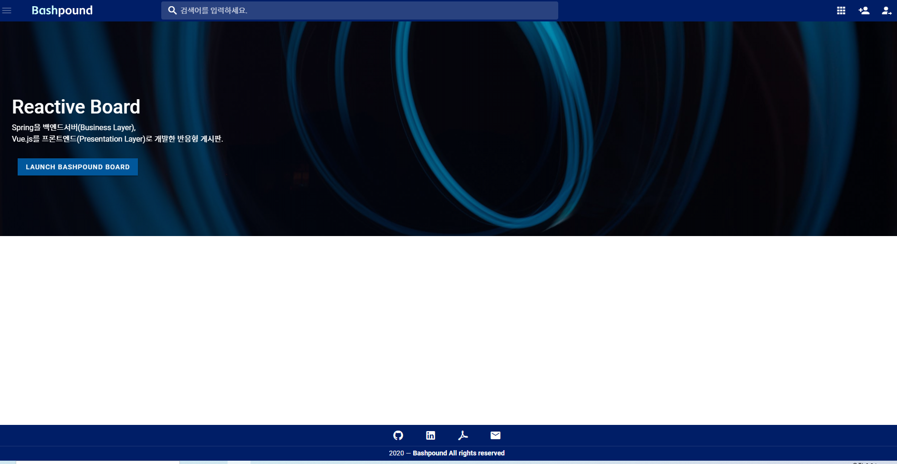

# Spring-vue/Marketplace
+ ## 프로젝트 설명(Project Header)
  + 스프링 부트 2.0/Vue.js (+ Router)로 구현한 반응형 싱글 페이지 쇼핑몰 어플리케이션
  + Oauth2(SNS로그인) 지원
  + JSON API 및 데이터 크롤링 기능 지원(예정)
  + 이메일 인증 지원(예정)

+ ## 개발 원칙 (Dev principles)
  + RESTful
  + no Http Redirection: 모든 개별 페이지는 VueRouter 혹은 Modal 처리
  + No JQuery: JQuery는 쓰지 않는다.
  + Data 접근 패턴: FLUX
  + SOLID
  + svg AMAP: 로고 및 아이콘 요소는 가능하면 svg 만을 사용한다.
  + API Concurrency: 모든 Framework, API는 가능하면 최신 버전을 사용한다.

+ ## 구현 도구들(Build tools)
  + Unit test : JEST
  + e2e test : Nightwatch
  + ES5-6 compatibility module: ESlint
  + Vue setting: +Vuex, +Router
  
  + Database : Ojdbc6 XE 
  + Presentation: Node.js (12.18.0)
  + Design: (Vue.js)@vue/cli 4.4.6, BootstrapVue(4.5.1), SCSS, inline CSS
  + Business Logic Layer : Embedded Tomcat on springBoot
  + Http proxy: Axios
  + Communication ports: 3000(Front/Client)<->8090(Back/Server)
  + Spring Dependencies: JPA, Web, DevTools, Thymeleaf(?maybe), RESTful, Security, Transaction(?maybe), Oauth2, Social(?maybe)
  + Build: Maven 3.6.3
  + ORM Mapping: Hibernate
  + Input validation : Vuelidate, Hibernate Validator
  + Logging: Slf4j
  + Getter/Setter: Lombok
  
+ ## Target issues
  + Ojdbc외 postgreSQL, Mysql, (+H2 DB) migration
  + Spring-boot -> Spring Legacy pjt migration
  + React.js branch
  + JSON Oauth2 --> Spring Social 로 정식 build

+ ##Live preview:
  + 1. Run demo.jar on cmd: java -jar demo.jar
  + 2. View on browser(IE not supported): localhost:8090/ 

## bashpound: 장은학(Jang Eunhack) / eunhackjang@gmail.com
